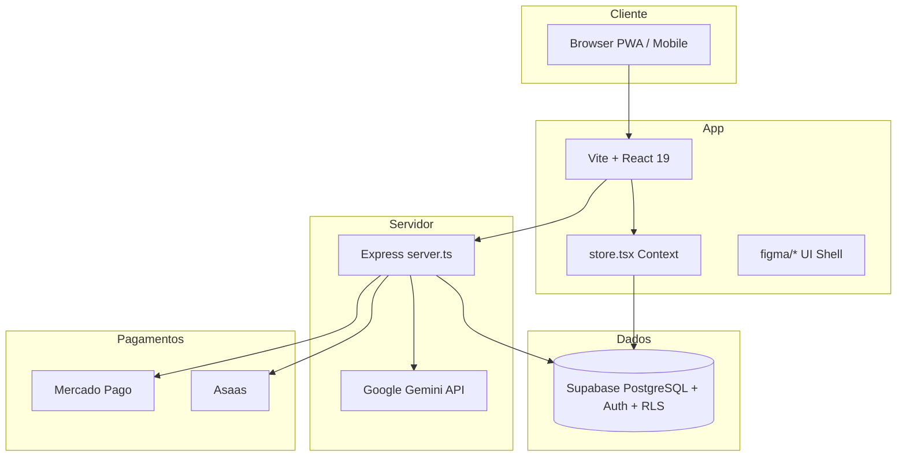
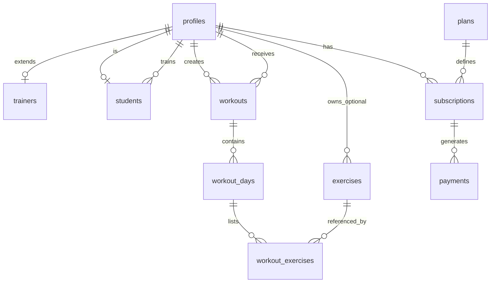

# AxosFit — Documentação do Sistema

> Documento consolidado do SaaS AxosFit (Axxos Fit).  
> Última atualização com base no repositório e em `docs/AxxosFit Docs/AI_CONTEXT.md`.

---

## Índice

1. [Visão geral](#1-visão-geral)
2. [Modelo de negócio](#2-modelo-de-negócio)
3. [Personas e papéis](#3-personas-e-papéis)
4. [Fluxos principais](#4-fluxos-principais)
5. [Arquitetura](#5-arquitetura)
6. [Estrutura do repositório](#6-estrutura-do-repositório)
7. [Banco de dados](#7-banco-de-dados)
8. [API (backend Express)](#8-api-backend-express)
9. [Frontend](#9-frontend)
10. [Regras de negócio](#10-regras-de-negócio)
11. [Integrações](#11-integrações)
12. [Variáveis de ambiente](#12-variáveis-de-ambiente)
13. [Execução local e deploy](#13-execução-local-e-deploy)
14. [Roadmap](#14-roadmap)
15. [Documentação relacionada](#15-documentação-relacionada)

---

## 1. Visão geral

**AxosFit** é uma plataforma **SaaS Mobile First** para **personal trainers** gerenciarem alunos, treinos, avaliações físicas, finanças e recursos de IA.

| Aspecto | Descrição |
|--------|-----------|
| Cliente pagante | Personal trainer (ou assessoria/estúdio) |
| Usuário final | Aluno do personal — **não paga** pelo sistema |
| Objetivo | Gestão integrada de treinos, evolução, cobrança do personal e automação com IA |
| Foco UX | Smartphone após o login |

**Produtos futuros:** AxosNutri (nutricionistas), mesmo login/aluno, módulos e cobrança modulares.

---

## 2. Modelo de negócio

### Trial

- Novo personal: **14 dias grátis** (produto), plano **Starter**, sem cartão obrigatório.
- No cadastro: usuário Auth → profile → trainer → assinatura trial → login automático → painel.
- No banco (`supabase_setup.sql`), o trigger de signup pode criar trial de **7 dias** no slug `bronze`/`starter` — alinhar ambiente de produção com a regra de produto desejada.

### Planos (produto)

| Plano | Preço | Alunos ativos | Destaques |
|-------|-------|---------------|-----------|
| **Starter** | R$ 99,90/mês | até 10 | Treinos, app do aluno, suporte e-mail |
| **Pro** | R$ 149,90/mês | até 20 | + avaliação física, IA básica, financeiro, WhatsApp |
| **Studio** | R$ 189,90/mês | ilimitados | Tudo do Pro + escala |

No banco existem também slugs legados/alternativos: `bronze`, `silver`, `gold`, `starter`, `pro`, `studio`, `teste` — com flags de feature (`ai_enabled`, `financial_enabled`, etc.).

### Limites por plano

| Slug (produto) | Limite de alunos |
|----------------|------------------|
| Starter | 10 |
| Pro | 20 |
| Studio | Ilimitado |

Controle via tabela `plans.max_students` e `FeatureGate` / `useSubscription` no frontend.

---

## 3. Personas e papéis

### Papéis (`profiles.role`)

| Role | Descrição |
|------|-----------|
| `trainer` | Personal trainer — dono da conta SaaS |
| `student` | Aluno vinculado a um trainer |
| `admin` | Superadmin da plataforma |

### Superadmin

- E-mails/perfil configurados em `src/lib/superadmin.ts`.
- Bypass de assinatura e acesso à página **Superadmin** (gestão global de trainers).

---

## 4. Fluxos principais

### 4.1 Cadastro do personal

Campos típicos: nome, e-mail, senha, CPF, CREF, telefone, data de nascimento, endereço completo.

```
Cadastro → Supabase Auth → profiles (+ trigger) → trainers → subscriptions (trial) → Dashboard
```

### 4.2 Cadastro do aluno

- **Sem** cadastro público; o personal cria a conta.
- Campos: nome, e-mail, telefone, CPF, nascimento, mensalidade, vencimento, endereço, objetivo.
- Fluxo: Auth → profile (`student`) → registro em `students` vinculado ao `trainer_id`.

### 4.3 Assinatura e pagamento (personal)

```
Trial → expiração → checkout → gateway (MP / Asaas) → webhook → subscriptions atualizada → liberação de features
```

**Regra crítica:** nunca confiar só no frontend para validar pagamento; sempre confirmar via **webhook** no servidor.

### 4.4 Treino do aluno

```
workouts → workout_days (A, B, C…) → workout_exercises (séries, reps, carga, descanso)
```

Múltiplos treinos **ativos** por aluno; criar um novo **não** desativa os demais.

### 4.5 Avaliação física vs anamnese

| Tipo | Conteúdo |
|------|----------|
| **Anamnese** | Objetivo, histórico, lesões, restrições, medicamentos |
| **Avaliação física** | Peso, altura, IMC, % gordura, perímetros (braço, peitoral, cintura, etc.) |

Entidades no código: `PhysicalAssessment`, `BodyMeasurement`, `ProgressPhoto`.

---

## 5. Arquitetura



### Stack (implementação atual)

| Camada | Tecnologia |
|--------|------------|
| Frontend | React 19, TypeScript, Vite 6, Tailwind CSS 4 |
| Estado | React Context (`services/store.tsx`) |
| Backend | **Express** (`server.ts`) — não FastAPI neste repo |
| Banco | Supabase (PostgreSQL) |
| Auth | Supabase Auth |
| IA | Google Gemini (`@google/genai`) |
| Pagamentos | Mercado Pago (checkout) + rotas Asaas (assinatura recorrente) |
| Deploy | Vercel (SPA rewrite) + servidor Node em produção |

---

## 6. Estrutura do repositório

```
AxosFit/
├── server.ts                 # API Express + Vite dev middleware
├── api/create-checkout.ts    # Handler serverless (Vercel) alternativo
├── supabase_setup.sql        # Schema, RLS, seeds de plans
├── supabase/migrations/      # Migrações incrementais
├── public/                   # PWA (manifest, icons, sw.js)
├── docs/
│   ├── SISTEMA.md            # Este arquivo
│   └── AxxosFit Docs/        # AI_CONTEXT, DATABASE, regras, roadmap
└── src/
    ├── App.tsx               # Roteamento auth, trial, checkout, apps
    ├── main.tsx
    ├── types.ts              # Tipos de domínio
    ├── components/           # Landing, Auth, Checkout, layouts legados
    ├── figma/                # UI principal (Trainer / Student apps)
    ├── services/
    │   ├── store.tsx         # Estado global + CRUD Supabase
    │   ├── subscription.ts   # Trial e verificação de assinatura
    │   ├── billing.ts
    │   ├── dataLoader.ts
    │   └── supabase.ts
    ├── hooks/useSubscription.ts
    └── lib/                  # supabase client, masks, superadmin
```

---

## 7. Banco de dados

Fonte principal: `supabase_setup.sql` + migrações em `supabase/migrations/`.

### Diagrama entidade-relacionamento (simplificado)



### Tabelas principais

| Tabela | Função |
|--------|--------|
| `profiles` | Perfil ligado a `auth.users` (nome, e-mail, role, avatar) |
| `plans` | Definição de planos SaaS e feature flags |
| `subscriptions` | Assinatura do trainer (`trial`, `active`, `pending`, `past_due`, `canceled`) |
| `students` | Aluno + vínculo `trainer_id` |
| `workouts` | Ficha de treino por aluno |
| `workout_days` | Divisões (Treino A, B, segunda-feira…) |
| `exercises` | Biblioteca (global se `trainer_id` null) |
| `workout_exercises` | Prescrição: sets, reps, `rest_time`, `load_kg`, notes |
| `payments` | Cobranças SaaS do trainer |
| `notifications` | Notificações do trainer |

### RLS (Row Level Security)

- Multi-tenant: trainer vê **apenas** seus alunos, treinos e assinatura.
- Aluno acessa treinos onde `student_id = auth.uid()`.
- Admin tem políticas ampliadas.
- `plans`: leitura pública; escrita restrita.

### Regra dos exercícios

O registro em `exercises` é só o **modelo** (nome, grupo muscular, vídeo).

**Não** armazenar no exercício: carga, séries, repetições, descanso — isso fica em `workout_exercises`.

---

## 8. API (backend Express)

Endpoints definidos em `server.ts`:

| Método | Rota | Função |
|--------|------|--------|
| `POST` | `/api/create-checkout` | Preferência Mercado Pago + lookup `plans` |
| `POST` | `/api/webhook` | Webhook Mercado Pago |
| `POST` | `/api/asaas/create-customer` | Cliente Asaas |
| `PUT` | `/api/asaas/trainer/:trainerId` | Atualizar dados Asaas do trainer |
| `POST` | `/api/asaas/create-subscription` | Assinatura recorrente Asaas |
| `POST` | `/api/asaas/webhook` | Webhook Asaas |
| `GET` | `/api/asaas/subscription/:trainerId` | Consulta assinatura |
| `POST` | `/api/gemini/suggest-workout` | Sugestão de treino via Gemini |

Em desenvolvimento, o Vite é servido pelo mesmo processo Express (`npm run dev` → `tsx server.ts`).

---

## 9. Frontend

### Roteamento (`App.tsx`)

| Estado | Tela |
|--------|------|
| Sem sessão | `LandingPage`, auth (`FigmaAuthBridge`), `CheckoutPage` |
| Primeiro login | `PasswordResetScreen` |
| Trainer/admin | `TrainerFigmaApp` (se assinatura válida) ou bloqueio/checkout |
| Student | `StudentFigmaApp` |
| Upgrade pendente | `CheckoutPage` com plano em `sessionStorage` |

### App do personal (`TrainerFigmaApp`)

| Página | ID | Descrição |
|--------|-----|-----------|
| Dashboard | `dashboard` | Métricas e visão geral |
| Alunos | `students` | CRUD e acompanhamento |
| Treinos | `workouts` | Protocolos e divisões |
| App do Aluno | `student-app` | Preview da experiência do aluno |
| Avaliação | `assessment` | Métricas corporais |
| Financeiro | `financial` | Receitas e cobranças (Pro+) |
| IA | `ai` | Assistente Gemini (Pro+) |
| Configurações | `settings` | Conta e integrações |
| Superadmin | `superadmin` | Gestão global |

Layout: **Sidebar** (desktop) + **BottomNav** (mobile), tema dark, componentes em `src/figma/components/`.

### Estado global (`store.tsx`)

Centraliza: login, registro, alunos, treinos, exercícios, logs, avaliações, pagamentos, notificações, achievements, stats premium, chat IA.

Modo offline/demo quando Supabase não está configurado (dados locais + `dataLoader`).

### Feature gating

`FeatureGate` + `useSubscription` bloqueiam por plano:

- `ai`, `financial`, `gamification`, `pdf`, `custom_branding`, `whatsapp_support`, `elite_badge`

---

## 10. Regras de negócio

### Treinos

- Um aluno pode ter **vários** treinos ativos (A, B, C…).
- **Não** desativar treinos existentes ao criar novos.
- Cada treino: nome, dias, exercícios com séries/reps/descanso/carga.

### Assinatura

- Status: `trial` | `active` | `pending` | `past_due` | `canceled` | `none`.
- Middleware em `App.tsx`: verifica assinatura; se `none`, tenta `createStarterTrial`.
- Superadmin ignora bloqueio.

### IA

- Auxilia o personal; **não** substitui o profissional.
- Gera sugestões e insights; **não** altera dados automaticamente sem ação do usuário.

### Pagamentos

- Validação de pagamento **sempre** via webhook no servidor.
- Frontend apenas inicia checkout e exibe status.

---

## 11. Integrações

### Supabase

- Auth (e-mail/senha).
- PostgreSQL com RLS.
- Trigger `handle_new_user_profile` cria `profiles` e trial em signup de trainer.

### Mercado Pago

- `POST /api/create-checkout` cria preferência com `external_reference = trainerId`.
- Webhook em `/api/webhook` atualiza `subscriptions` / `payments`.

### Asaas

- Rotas dedicadas para customer, subscription e webhook.
- Planejado como fluxo principal de recorrência em `AI_CONTEXT.md`; MP também implementado no código.

### Google Gemini

- Endpoint `/api/gemini/suggest-workout`.
- Uso no store: `getAISuggestions`, `askAIChat`.

---

## 12. Variáveis de ambiente

Ver `.env.example`:

| Variável | Uso |
|----------|-----|
| `GEMINI_API_KEY` | API Gemini |
| `APP_URL` | URL pública (callbacks, webhooks MP) |
| `VITE_SUPABASE_URL` | Projeto Supabase |
| `VITE_SUPABASE_ANON_KEY` | Chave anon (client + server fallback) |
| `VITE_MERCADO_PAGO_PUBLIC_KEY` | Checkout MP no client |
| `MERCADO_PAGO_ACCESS_TOKEN` | API MP no servidor |

Variáveis Asaas: configuradas no servidor conforme implementação em `server.ts` (não listadas no `.env.example` — adicionar ao configurar produção).

---

## 13. Execução local e deploy

### Local

```bash
npm install
cp .env.example .env.local   # preencher chaves
npm run dev                  # Express + Vite na porta 3000
```

```bash
npm run build   # vite build + bundle server → dist/
npm start       # node dist/server.cjs
```

### Deploy

- **Vercel:** `vercel.json` — SPA fallback para `index.html`.
- API serverless alternativa: `api/create-checkout.ts`.
- Produção full-stack: executar `server.cjs` com variáveis de ambiente e `APP_URL` HTTPS para webhooks.

### Qualidade

```bash
npm run lint    # tsc --noEmit
```

---

## 14. Roadmap

Status em `docs/AxxosFit Docs/08 - Roadmap.md`:

| Fase | Itens |
|------|--------|
| **MVP** | Login, cadastro, Supabase, exercícios ✅ — Avaliação física, Asaas, app mobile ⏳ |
| **V1** | IA Coach, dashboard financeiro, push |
| **V2** | Axos Nutri, marketplace |

---

## 15. Documentação relacionada

| Arquivo | Conteúdo |
|---------|----------|
| `docs/AxxosFit Docs/AI_CONTEXT.md` | Contexto para IA e desenvolvedores |
| `docs/AxxosFit Docs/DATABASE.md` | Resumo de tabelas (parcial) |
| `docs/AxxosFit Docs/Regras/*.md` | Planos, treinos, trial |
| `docs/AxxosFit Docs/08 - Roadmap.md` | Roadmap |
| `supabase_setup.sql` | Schema completo e seeds |
| `FIGMA.md` | Integração design Figma Make |

### Diretrizes para alterações

1. Ler `AI_CONTEXT.md`, schema (`supabase_setup.sql`) e regras de pagamento.
2. Não quebrar funcionalidades existentes.
3. TypeScript strict; mobile first.
4. Supabase como fonte de verdade.
5. Não alterar schema sem validar migrações e RLS.

---

## Glossário

| Termo | Significado |
|-------|-------------|
| **Personal / Trainer** | Cliente SaaS pagante |
| **Aluno / Student** | Usuário final do personal |
| **Ficha / Workout** | Plano de treino com dias e exercícios prescritos |
| **Trial** | Período gratuito antes da assinatura paga |
| **RLS** | Row Level Security — isolamento multi-tenant no Postgres |

---

*Gerado automaticamente a partir do código e da documentação do repositório AxosFit.*
